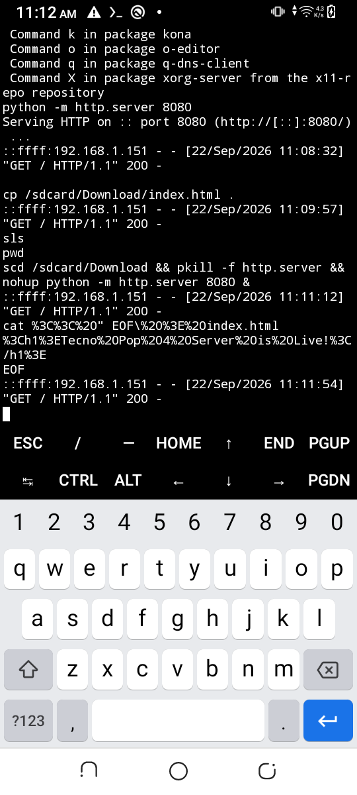
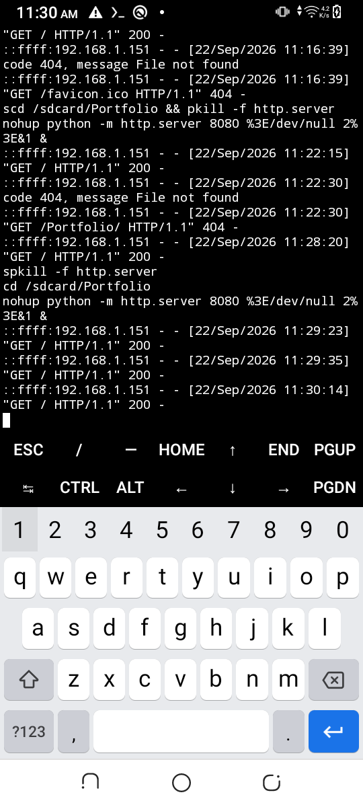

# Termux Server 📱⚡

Ein leichtgewichtiges **Python Edge Security Gateway & Router WAF** mit interaktivem Web-Dashboard und Remote-Verwaltungs-Suite. Das System läuft komplett autonom und drahtlos auf einem Android-Gerät (Tecno Pop 4 Pro, MediaTek MT6739) über **Termux**.

---

## 📁 Projektstruktur & Dateiübersicht

```text
MagicTricks/
├── server_manager.bat       # 🌟 Zentrales Master-Menü zur Steuerung aller Aufgaben
├── secure_gateway.py        # 🛡️ WAF & Gateway-Microservice (Starlette + Uvicorn)
├── scripts/                 # ⚙️ Modulare Windows-Batch-Skripte
│   ├── connect.bat          # [1] Drahtlose ADB-Verbindung herstellen & Display wachhalten
│   ├── status.bat           # [2] WAF-Status, offene Ports & Bedrohungsmetriken prüfen
│   ├── mirror.bat           # [3] Scrcpy-Display-Spiegelung starten (Maus/Tastatur-Steuerung)
│   ├── adb_shell.bat        # [4] Direkte ADB-Konsole öffnen (ohne Passwort)
│   ├── ssh.bat              # [5] Sichere Termux-SSH-Verbindung öffnen (Port 8022)
│   └── deploy.bat           # [6] Dateien per Drag & Drop auf das Smartphone pushen
├── screenshots/             # 📸 Dokumentation & UI-Referenzbilder
│   ├── termux_screen.png    # Termux Erstkonfiguration & Pakete
│   ├── termux_cur.png       # Live-Prozesse & Server-Logs
│   ├── termux_now.png       # WAF-Inspektions-Ausgaben
│   └── portfolio_termux.png # HTTP-Server & Port-Tests
├── README.md                # 📖 Projektdokumentation (deutsch)
└── .gitignore               # 🔒 Ausschluss von Schlüsseln, Logs & Binärdateien
```

---

## 🚀 Übersicht & Motivation

Dieses Projekt demonstriert praxisorientiertes Reverse-Engineering und Hardware-Upcycling: Ein ausrangiertes Smartphone mit funktionierendem Display, aber **vollständig defektem Touchscreen (keine Eingabe möglich)**, wird ohne OTG-Maus oder Adapter in einen robusten, kabellosen Edge-Security-Server verwandelt.

---

## 📱 Hardware-Voraussetzungen & Smartphone-Vorbereitung

### 1. Voraussetzungen auf dem PC
- **Betriebssystem:** Windows 10/11
- **Android SDK Platform-Tools:** `adb.exe` (entweder über Android Studio oder eigenständig)
- **OpenSSH Client:** Standardmäßig in Windows integriert

### 2. Smartphone-Vorbereitung (Entwickleroptionen & USB-Debugging)
1. **Entwickleroptionen freischalten:**
   - Navigieren zu `Einstellungen` > `System` > `Über das Telefon`.
   - 7-mal schnell auf die `Build-Nummer` tippen, bis die Meldung *"Sie sind jetzt Entwickler!"* erscheint.
2. **USB-Debugging aktivieren:**
   - `Einstellungen` > `System` > `Entwickleroptionen` öffnen.
   - **USB-Debugging** aktivieren.
   - **Wachbleiben beim Laden** (Stay Awake) aktivieren.
3. **Computer autorisieren:**
   - Smartphone per USB-Kabel mit dem PC verbinden.
   - Im Dialog *"USB-Debugging zulassen?"* die Option **"Von diesem Computer immer zulassen"** aktivieren und bestätigen.

---

## 🔧 Installation & Server-Einrichtung auf dem Smartphone

Sobald das Gerät autorisiert ist, erfolgen alle weiteren Schritte kabellos über SSH oder ADB:

1. **Termux-Speicherzugriff gewähren:**
   ```bash
   termux-setup-storage
   ```

2. **Notwendige Pakete & Python-Abhängigkeiten installieren:**
   ```bash
   pkg update -y
   pkg install -y openssh python python-pip
   pip install starlette uvicorn aiosqlite
   ```

3. **SSH-Server konfigurieren:**
   ```bash
   passwd          # Sicheres Passwort festlegen (z.B. technoserver)
   sshd            # SSH-Daemon auf Port 8022 starten
   termux-wake-lock
   ```

4. **WAF Gateway im Hintergrund starten:**
   ```bash
   nohup python -m uvicorn secure_gateway:app --host 0.0.0.0 --port 8000 --workers 1 > ~/gateway.log 2>&1 &
   ```

---

## 🕹️ Bedienung über das Windows Control Hub (`server_manager.bat`)

Um die Eingabe langer Konsolenbefehle zu vermeiden, steht das zentrale Menü [`server_manager.bat`](server_manager.bat) bereit. Doppelklicken Sie auf die Datei, um das interaktive Menü aufzurufen:

```text
========================================================
       TECNO POP 4 PRO - CENTRAL CONTROL HUB
       IP: 192.168.1.126  |  Node: Headless Linux Server
========================================================

  [1] Connect Wireless ADB & Enable Always-On Screen
  [2] Check Server Status & Live WAF Metrics
  [3] Open GUI Dashboard in Browser (http://192.168.1.126:8000/dashboard)
  [4] Launch Screen Mirror (Scrcpy)
  [5] Open Direct ADB Shell (No Password)
  [6] Open SSH Terminal (Termux)
  [7] Deploy File to Phone (/sdcard/Download/)
  [8] Full Auto-Start Sequence (Connect + Check Status)
  [0] Exit
========================================================
```

### Ausführungsreihenfolge:
1. **Option `[1]` oder `[8]`:** Startet die drahtlose Verbindung und sperrt den Bildschirm gegen den Ruhemodus.
2. **Option `[2]`:** Führt einen Systemcheck durch (Ports `8000` & `8022`, WAF Health-Check und Bedrohungsstatistik).
3. **Option `[3]`:** Öffnet das moderne Web-Dashboard direkt in Ihrem Standardbrowser.
4. **Option `[4]`:** Startet `scrcpy` mit maßgeschneiderten Parametern für MediaTek-Chips (`800px`, `30fps`, `2Mbps`), um das Smartphone mit Maus und Tastatur zu bedienen.
5. **Option `[7]`:** Erlaubt das einfache Übertragen von Dateien auf das Smartphone.

---

## 🛡️ WAF-Features & Sicherheitsarchitektur

Das Gateway (`secure_gateway.py`) fungiert als Reverse-Proxy-WAF:

- **Deep-Packet Payload-Inspektion:**
  - SQL-Injection (Union-based, Boolean-based, Time-based Blind SQLi).
  - Cross-Site Scripting (XSS über Query-Parameter & JSON-Body).
  - Path-Traversal (`../`, `%2e%2e%2f`).
  - Remote Command Execution (RCE-Muster).
- **Token-Bucket Rate Limiter:** Blockiert DoS-Flooding mit HTTP `429 Too Many Requests`.
- **Echtzeit-Dashboard (`/dashboard`):** Anzeige von Live-Metriken, verdächtigen Mustern und Ursprungs-IPs.
- **IP-Regelwerk:** Schnelles Hinzufügen von IPs zur Whitelist oder Blacklist mit SQLite-Speicherung.
- **Integrierte Netzwerk-Tools:** DNS-Lookup, Ping-Latenztest, lokaler Port-Scanner und Routing-Inspektion direkt über die Web-Oberfläche.

---

## 📸 Screenshots

| Termux Umgebung & Server-Start | WAF-Logging & Abfragen |
| :---: | :---: |
|  |  |

---

## 🤝 Mitwirken (Contributions Welcome!)

Beiträge zur Weiterentwicklung sind herzlich willkommen!

1. **Forken** Sie das Repository.
2. Erstellen Sie einen neuen Feature-Branch (`git checkout -b feature/NeuesFeature`).
3. Nehmen Sie Ihre Änderungen vor und testen Sie diese auf dem Gerät oder lokal.
4. Committen Sie Ihre Änderungen (`git commit -m 'feat: Neues Feature hinzugefügt'`).
5. Pushen Sie den Branch (`git push origin feature/NeuesFeature`).
6. Öffnen Sie einen **Pull Request**.

---

## 🔒 Lizenz & Datenschutz

Dieses Projekt steht unter der MIT-Lizenz. Strikte `.gitignore`-Regeln stellen sicher, dass keine sensiblen Authentifizierungstoken, Logfiles oder Datenbankinhalte versioniert werden.
